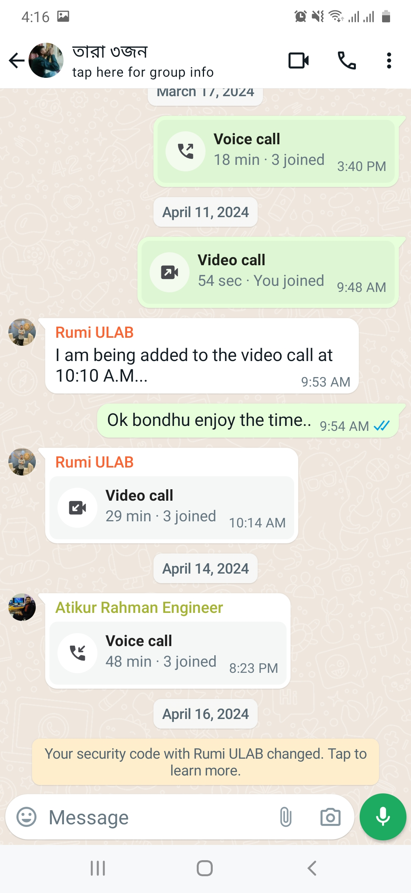
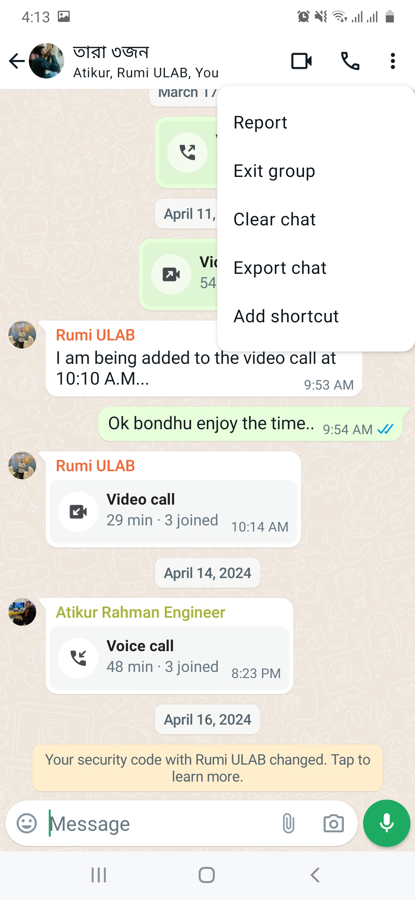
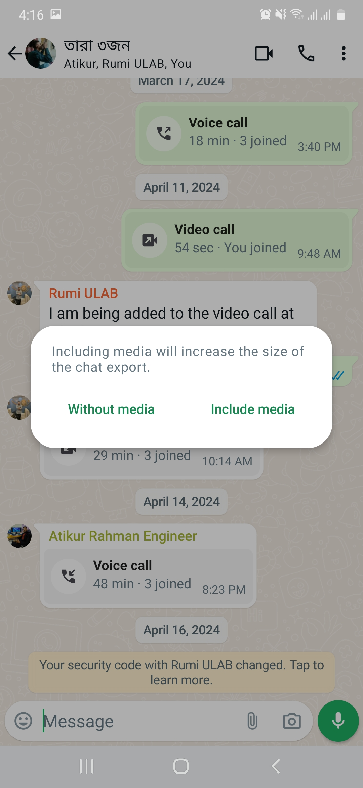
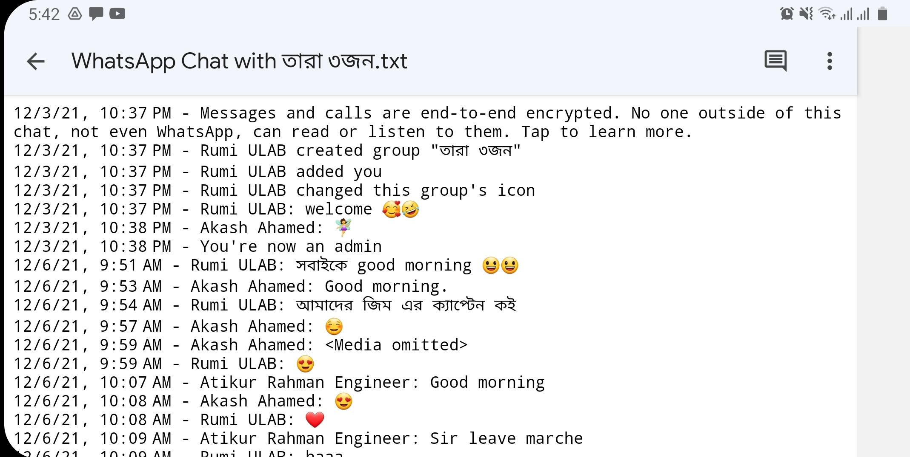

# WhatsApp Chat Sentiment Analysis
##### *Author:* Akash Ahamed

## *Overview*
- Introduction
- Data Preprocessing
  - Export WhatsApp Chat
  - Manipulate Text Data
      - Import Libraries
      - Regular Expression
      - Show New DataFrame
  - Data Analysis
      - Show Overall Analysis
          - Overall Analysis
          - Most Active User
          - Most Common Words
          - Most Used Emoji 
          - Most Activity Map
          - Daily Timeline
          - Month Timeline
      - Show Selected User Analysis
- Display DataFrame
- Conclusion

# *Introduction*:
Introduc some thing here....

## Demo
You can check out the live demo website [here](https://github.com/pankajkanani/whatsapp-link).

Show a Image of Website......
# *Data Preprocessing:*
The first step of  Data Preprocessing is to gather the data. Here we use a whatsApp chat real data. 
WhatsApp has a built-in feature for Export chat messages. WhatsApp Export chat feature allows to export chat messages as a .txt file.
After gathering the *.txt* file, our main preprocessing work will start, where we used Jupyter Notebook for data preprocessing.

## Export WhatsApp Chat.
Navigate to the chat you wish to analyze. It may be a private or group chat. 
To export android WhatsApp chat history from a chat. Go to the respective chat which wants to Export and Open the chat.

1. Open chat click option (Three dot).

  

2. Click on More.

  

3. Click Export Chat

  
4. Tap on Export Without Media.

  

#### NOTE: Here I select without media chat because we can only export 10,000 messages with media files and 40,000 messages without media files.
## Open the Export .txt file:
After the export chat history successfully we got a .zip file. After the unzip we find a .txt file. Opening the .txt file we get chat messages which look like the below format.

# *Manipulate Text Data:*
Our WhatsApp chat messages under a .txt file. We need to extract these chat messages from the .txt file and convert them into a dataframe for exploring the chat messages data. To convert WhatsApp chat messages into a dataframe we used Pandas dataframe and wrote the code using Jupyter Notebook.

  ## Import Libararies:
To perform data preprocessing work we need some library to convert raw data into DataFrame. After converting the raw data into a dataframe we can perform different kinds of activity with the data. For doing play with the data we need to import some necessary library, which are.

#### Necessary Libraries
  
    import re
    import pandas as pd

