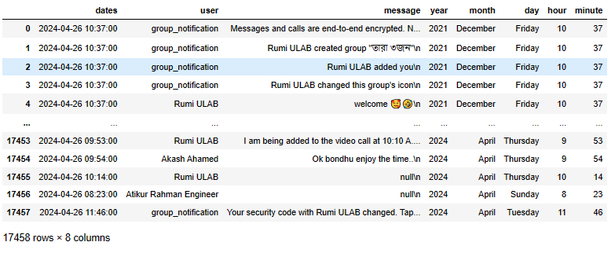

# WhatsApp Chat Analyzer
##### *Author:* **Akash Ahamed**

## *Overview*
- Introduction
- Data Preprocessing
  - Export WhatsApp Chat
  - Manipulate Text Data
      - Import Libraries
      - Regular Expression
      - Data Manipulating Task
      - Show New DataFrame
  - Data Analysis
      - Show Overall Analysis
          - Overall Analysis
          - Most Active User
          - Most Common Words
          - Most Used Emoji 
          - Most Activity Map
          - Daily Timeline
          - Month Timeline
      - Show Selected User Analysis
- Display DataFrame
- Conclusion

# *Introduction*:
Introduc some thing here....

## Demo
You can check out the live demo website [here](https://github.com/pankajkanani/whatsapp-link).

Show a Image of Website......
# *Data Preprocessing:*
The first step of  Data Preprocessing is to gather the data. Here we use a whatsApp chat real data. 
WhatsApp has a built-in feature for Export chat messages. WhatsApp Export chat feature allows to export chat messages as a .txt file.
After gathering the *.txt* file, our main preprocessing work will start, where we used Jupyter Notebook for data preprocessing.

## Export WhatsApp Chat.
Navigate to the chat you wish to analyze. It may be a private or group chat. 
To export android WhatsApp chat history from a chat. Go to the respective chat which wants to Export and Open the chat.

1. Open chat click option (Three dot).

  

2. Click on More.

  

3. Click Export Chat

  
4. Tap on Export Without Media.

  

#### NOTE: Here I select without media chat because we can only export 10,000 messages with media files and 40,000 messages without media files.
## Open the Export .txt file:
After the export chat history successfully we got a .zip file. After the unzip we find a .txt file. Opening the .txt file we get chat messages which look like the below format.

# *Manipulate Text Data:*
Our WhatsApp chat messages under a .txt file. We need to extract these chat messages from the .txt file and convert them into a dataframe for exploring the chat messages data. To convert WhatsApp chat messages into a dataframe we used Pandas dataframe and wrote the code using Jupyter Notebook.

  ## Import Libararies:
To perform data preprocessing work we need some library to convert raw data into DataFrame. After converting the raw data into a dataframe we can perform different kinds of activity with the data. For doing play with the data we need to import some necessary library, which are.

#### Necessary Libraries
  
    import re
    import pandas as pd

#### Upload WhatsApp Chat File: 
    file = open ('WhatsApp Chat with তারা ৩জন.txt','r', encoding='utf8')
#### Read the File as String Format: 
    data = file.read()
## Regular Expression:
Regular expressions are a sequence of characters used to define a search pattern for text. We used Python Regular Expression to extract data and messages from the .txt file. 
    
    pattern =r'\d{1,2}/\d{1,2}/\d{2,4},\s*\d{1,2}:\d{2}\s*[AP]M\s-\s'
    dates = re.findall(pattern, data)
    messages = re.split(pattern, data)[1:]

## Data Manipulating Task:
After the find .txt file pattern we perform some basic data  manipulation task for separated messages and dates. 

    dates = re.findall(pattern, data)
    messages = re.split(pattern, data)[1:]

#### Create DataFrame for Separate Messages and Dates:

    date=[]
    times=[]
    
    for i in dates:
    `  date.append(i.split(", ")[0])
      times.append(i.split(", ")[1])
    
    time=[]
    for i in times:
      time.append(i.split("\u202f")[0])
    
    df = pd.DataFrame({
        'User_Messages':messages,
        'Message_Date':date,
        'time': time,
      }) 
    
    df.head()

#### Separate Users and Messages:
    
    users =[]
    messages=[]

    for i in df['User_Messages']:
        whole_messages = re.split('([\w\W]+?):\s',i)
        if whole_messages[1:]:
          users.append(whole_messages[1])
          messages.append(whole_messages[2])
        else:
          users.append('group_notification')
          messages.append(whole_messages[0])

        df['user']= users
        
    df['message']= messages
    df.drop(columns=['User_Messages'], inplace=True)
    df.head()

#### Separate Day, Month, and Year:

    df['date']=pd.to_datetime(df['date'])

    df['year']=df['date'].dt.year
    df['month']=df['date'].dt.month_name()
    df['day'] = df['date'].dt.day_name()
    
    df.head()

### Show New DataFrame:
After performing the preprocessing our final data looks like as shown below.

**It's time to conduct analysis on the clean DataFrame that we now have.**

## Data Analysis:
The act of taking raw data and turning it into information that users can use to make decisions is known as data analysis. Analysis is the process of dissecting a whole thing into its constituent parts for closer inspection. In order to find any relevant information, it involves cleaning, converting, examining, and modeling data. This project provides a basic statistical analysis WhatsApp chat. Following are the analysis made:
>
>- To find total messages, total words, and total links shared in the WhatsApp chat.
>- To find the most active user
>- To find most common words
>- To find most used emoji
>- To find most activity map
>- To find most daily timeline
>- To find month timeline

### Show Overall Analysis

#### Overall Analysis:
It displays data such as the total number of words, messages, and shared links. The entire chat file was transformed into a data frame, the words and messages were divided, and URLextract was used to locate links.

#### Most Active User:
Is shows the busy users and their contribution to chat We have used matplotlib to plot the graph and the users and how frequently the chat is calculated and plotted. 
    
    x = df['user'].value_counts().head()
    name = x.index
    count = x.values
    plt.bar(name, count)
    plt.xticks(rotation='vertical')
    plt.show()

##### Find the Percentage of chat:
    
    dfd=round((df['user'].value_counts()/ df.shape[0])*100,2)
    dfd.reset_index().rename(columns={'user':'name','count':'percent'})
    
#### Most Common Words:
It shows the most commonly used word We have used matplotlib to plot the graph and the top frequently used words are displayed.
    
    words_most=[]
    for i in df['message']:
      words_most.extend(i.split())
    Counter(words_most)
    pd.DataFrame(Counter(words_most).most_common(20))
###### *Remove the Group message*    
    temp=df[df['user'] !='group_notification']
###### *Remove the media omit and store in  tem variable*
    temp=temp[temp['message']!='<Media omitted>\n']
    words_most=[]
    for i in temp['message']:
      words_most.extend(i.split())
    pd.DataFrame(Counter(words_most).most_common(20))

#### Most Used Emoji:
It shows the most commonly used emojis We have used the Emoji library to select or distinguish the emojis from the messages and plotted the pie chart using matplotlib

#### Most Activity Map:
It shows the busy days and months. We have used the matplotlib library to plot the graph, the number of messages in a particular month or day are mapped to the particular day or month
#### Daily Timeline:
It gives the frequency of messages in a day We have used matplotlib to plot the graph and the days are taken and the count of messages are calculated and plotted.
#### Month Timeline:
It gives the frequency of messages in a whole We have used matplotlib to plot the graph and the months are taken and the count of messages are calculated and plotted.

### Show Selected User Analysis
